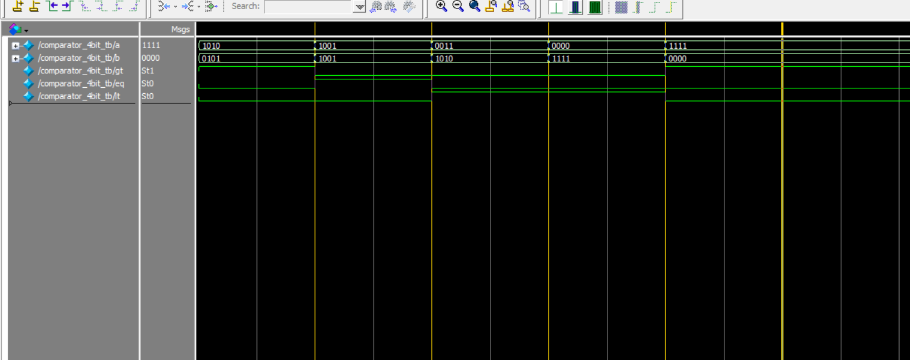

# Verilog 4-bit Comparator

This project implements a 4-bit comparator in Verilog, tested with ModelSim.

## 🧾 Files
- `comparator_4bit.v` — 4-bit comparator design file
- `comparator_4bit_tb.v` — Testbench for simulation
- `monitor_log.txt` — Output log from testbench
- `wave_comparator_4bit_tb.png` — Waveform screenshot from ModelSim

## 🔍 Function
Compares 4-bit inputs `a` and `b` and outputs:
- `gt` (a > b)
- `eq` (a == b)
- `lt` (a < b)

## 📊 Waveform

